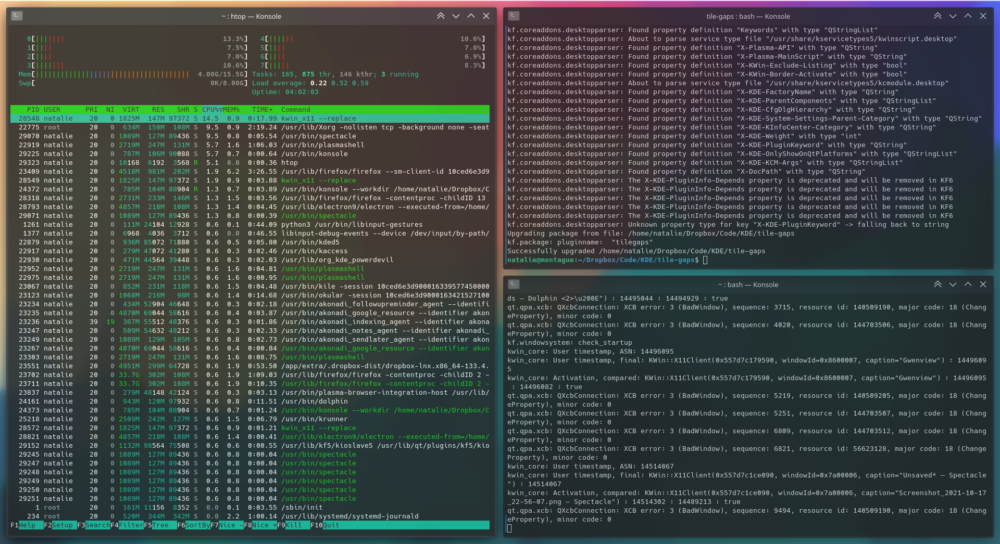

# Tile Gaps

Extension for KDE's window manager to add space around windows snapped to a half or quarter of the screen.

The size of the margins is configurable.



[view in KDE Store](https://www.pling.com/p/1619642/)


## Installation

### Method 1: via graphical interface

1. Install the script via *System Settings* > *Window Management* > *KWin Scripts* > *Get New Scripts …* > search for *Tile Gaps* > *Install*.
2. Activate the script by selecting the checkbox in the *Tile Gaps* entry.

### Method 2: via command line

```bash
git clone https://github.com/nclarius/tile-gaps.git
plasmapkg2 --type kwinscript -i tile-gaps
kwriteconfig5 --file kwinrc --group Plugins --key tilegapsEnabled true
qdbus org.kde.KWin /KWin reconfigure
```


## Configuration

*System Settings* > *Window Management* > *KWin Scripts* > configuration button in the *Tile Gaps* entry.

You may have to disable and reenable the script in order for the changes to take effect.

If the configuration button is missing, try the following:

````bash
mkdir -p ~/.local/share/kservices5
ln -sf ~/.local/share/kwin/scripts/tilegaps/metadata.desktop ~/.local/share/kservices5/tilegaps.desktop
````

If that still doesn’t work, you can make the changes in the source code:

1. Download and the code via GitHub (top right green button *Code* > *Download ZIP*) or KDE store (top right purple button *Download*) and unpack.
2. In ` contents/code/main.js`, change the values `12` at the beginning of the file to your preferences.
3. Reinstall the script by starting a terminal window in the `tile-gaps` folder and running the command

    ```bash
    plasmapkg2 --type kwinscript -u .
    ```

4. Restart the KWin session by starting a terminal window and running the command

   ````bash
   kwin_x11 --replace &
   ````
   
  
## Small Print

© 2021 Natalie Clarius \<natalie_clarius@yahoo.de\>

If you would like to thank me, you can [buy me a coffee](https://www.paypal.com/donate?hosted_button_id=7LUUJD83BWRM4).

